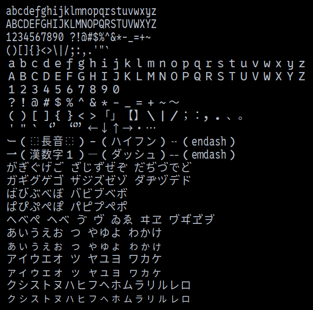

# 0xProGen

Japanese Font for programming ([0xProto](https://github.com/0xType/0xProto) + [HackGen](https://github.com/yuru7/HackGen))

## How to create the font

* Install fontforge and python3-fontforge
    * `sudo apt install fontforge python3-fontforge`
* (Optional) Clone the nerd-fonts repository
    * `git clone https://github.com/ryanoasis/nerd-fonts.git`
    * This repository is huge and takes a long time to clone
* Invoke the shell script
    * `./generate.sh`

## Sample

